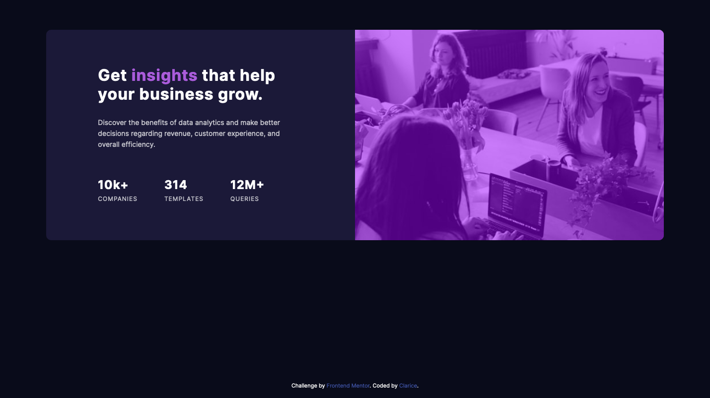
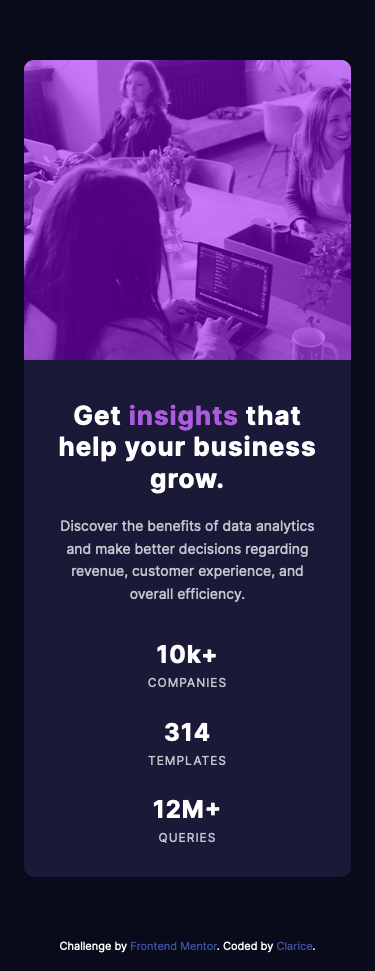

# Frontend Mentor - Stats preview card component solution

This is a solution to the [Stats preview card component challenge on Frontend Mentor](https://www.frontendmentor.io/challenges/stats-preview-card-component-8JqbgoU62). Frontend Mentor challenges help you improve your coding skills by building realistic projects. 

## Table of contents

- [Overview](#overview)
  - [The challenge](#the-challenge)
  - [Screenshot](#screenshot)
  - [Links](#links)
- [My process](#my-process)
  - [Built with](#built-with)
  - [What I learned](#what-i-learned)
  - [Continued development](#continued-development)
  - [Useful resources](#useful-resources)
- [Author](#author)

## Overview

### The challenge

Users should be able to:

- View the optimal layout depending on their device's screen size

### Screenshot

### Links

- Solution URL: [My solution](https://www.frontendmentor.io/solutions/mobile-first-vanilla-css-using-flexbox-and-grid-2sjkKbgeq)
- Live Site URL: [Live site URL](https://claricer.github.io/card_component-fe_m/)

## My process

### Built with

- Semantic HTML5 markup
- CSS custom properties
- Flexbox
- CSS Grid
- Mobile-first workflow

### What I learned

This challenge was great to practice making a responsive card layout. I tried to solve it without giving fixed sizes as much as I could. 

I learned that we can use more than one background "image" in the same property, separating them with commas. However, we can't add a solid color, so the way I achieved the overlay effect was using a linear gradient, repeating the same colour with transparency. I thought that was pretty cool.

I also enjoyed choosing the way the image would resize, because in this case, it was more interesting kepping the face of the lady who is smilling always visible. 

Another aspect that I really enjoyed was using the BEM approach to my classes. I will be focused on learning and improving with this method from now on.

When adding border radius to the card, the image covers the corners. One way to fix that is applying overflow hidden to the card.

I could see really quickily that althoug using inherit for box-sizing is good, using inherit for margin is a terrible idea 😆

### Continued development

I'm interested in getting more practice with BEM and also looking into concepts like OOCSS.
Also, I want to make the final product accessible and respecting users preferences.

### Useful resources

- [Tinted image](https://css-tricks.com/tinted-images-multiple-backgrounds/) - I learned how to do the tinted image with this article.
- [Fluid font size](https://css-tricks.com/linearly-scale-font-size-with-css-clamp-based-on-the-viewport/) - I've ended up not using this, but it seems an interesting thing to try out.

## Author

- Website - [Clarice](https://github.com/ClariceR)
- Frontend Mentor - [@ClariceR](https://www.frontendmentor.io/profile/ClariceR)
- Twitter - [@clari_ce_r](https://twitter.com/clari_ce_r)

